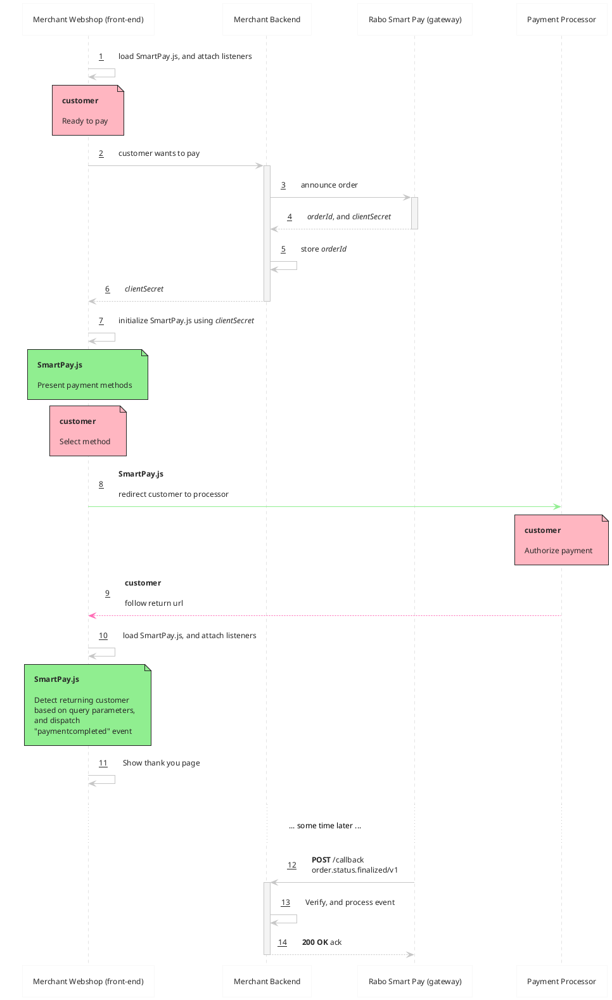
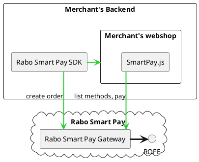

# SmartPay.js

## Table of contents
1. [Introduction](#introduction)
2. [Open questions](#open-questions)
3. [Overview](#overview)
    1. [Sequence diagram](#sequence-diagram)
    2. [Dispatched events](#dispatched-events)
4. [Integration example](#integration-example)
5. [Implementation notes](#implementation-notes)
    1. [Component diagram](#component-diagram)
    2. [ROFE](#rofe)
    3. [JS](#js)
    4. [SDK](#sdk)
6. [Requirements answered](#requirements-answered)
7. [Glossary](#glossary)
8. [Appendix](#appendix)
    1. [Comparison with competitors](#comparison-with-competitors)


---


## Introduction
In response to [SmartPay.js - Drop-in Elements](https://confluence.dev.rabobank.nl/pages/viewpage.action?spaceKey=MCS&title=SmartPay.js+-+Drop-in+Elements).


## Open questions

#### Business
- Are merchants [PCI DSS v4.0 SAQ-A (pdf)](https://docs-prv.pcisecuritystandards.org/SAQ%20(Assessment)/SAQ/PCI-DSS-v4-0-SAQ-A-r2.pdf) compliant?
- Do we also want to support API-only based card transactions for PCI compliant merchants?
- Does all of this also apply to mobile apps (iOS, and Android)?

#### Technical
- Can we host the JS files on a separate sub-domain (e.g. [js.pay.rabobank.nl](https://js.pay.rabobank.nl)?) to help with [CSP](https://developer.mozilla.org/en-US/docs/Web/HTTP/CSP)?
- Does Rabobank have a CDN to host assets (e.g. payment method logo's)?
- Do we also provide React components, is such a think desired?
- Are new endpoints implemented on an existing service, or a new one (perhaps even a JS/TS application)?
- Do we want to implement a client-side auth solution (similar to [how Adyen does it](https://docs.adyen.com/development-resources/client-side-authentication/))?


## Overview
SmartPay.js is a browser-side JavaScript library that enabled merchants to build embedded checkout flows.

It has the following features:
- A set of pre-built UI components (e.g. buttons for supported payment methods, QR-code display).
- A secure credit card entry form, including client-side CHD encryption, and tokenization.
- Returning customer detection.
- Fully customisable in terms of styling, and localisation.
- Dispatches all sort of events for easy integration with other JavaScript code.

### Sequence diagram
This example assumes a payment type where the customer is redirected.



### Dispatched events
| event type | description | dispatched when |
|---|---|---|
| `methodselected`  | Payment method selected. | Customer selected a payment method. |
| `paymentcomplete` | Payment is successfully completed. | Embedded payment succeeded, or customer returned from external payment processor. |


## Integration example
Modelled after [Mollie Components](https://docs.mollie.com/docs/mollie-components#option-2-mollie-components), actual
implementation might be different

```html
<script>
    const clientSecret = "1953dc51-33a9-44af-9f48-234e519000f3"; // passed by backend

    const smartPay = new SmartPay();
    smartPay.addEventListener("paymentcomplete", (e) => { alert("Thank you for your purchase"); });

    smartPay.initialize(clientSecret);


    smartPay.showPaymentMethods

</script>
<body>
    <form>
        <div id="card-number"></div>
        <div id="card-number-error"></div>

        <div id="card-holder"></div>
        <div id="card-holder-error"></div>

        <div id="expiry-date"></div>
        <div id="expiry-date-error"></div>

        <div id="verification-code"></div>
        <div id="verification-code-error"></div>

        <button type="button">Pay</button>
    </form>
</body>
<script>
    const clientSecret = '1953dc51-33a9-44af-9f48-234e519000f3'; // passed by backend

    const smartPay = SmartPay();
    smartPay.initialize(clientSecret);
    smartPay.addEventListener("paymentcomplete", (e) => { alert('Thank you for your purchase'); });

    const cardNumber = smartPay.createComponent('cardNumber');
    cardNumber.mount('#card-number');

    var cardHolder = smartPay.createComponent('cardHolder');
    cardHolder.mount('#card-holder');

    var expiryDate = smartPay.createComponent('expiryDate');
    expiryDate.mount('#expiry-date');

    var verificationCode = smartPay.createComponent('verificationCode');
    verificationCode.mount('#verification-code');
</script>
```


## Implementation notes

### Component diagram


### ROFE
- New endpoints.
    - `order.create` Create order, proxies existing Order announcement.
    - `order.listmethods` Returning a list of methods applicable to the order.
    - `order.pay` Pay an order, returns an action for the client to react to.
    - `order.status` Retrieve the status of an order, proxies existing status endpoint.
    - `order.cancel` Cancels an order (as to not have too much expired order in case of abandonment).
    - `methods.list` List methods outside of an Order scope. (slice 2)
- Alternative authentication method.

### JS
- Published on NPM.
- Wrapping of wallets (including click-to-pay). (slice 2)

### SDK
- "Simple" bridging of JS to new endpoints.


## Requirements answered
Taken from the [Confluence page mentioned above](https://confluence.dev.rabobank.nl/pages/viewpage.action?spaceKey=MCS&title=SmartPay.js+-+Drop-in+Elements), and answered based on the proposed solution.

| Requirement                           | Description                                                  | Answer                                                       |
|---------------------------------------|--------------------------------------------------------------|--------------------------------------------------------------|
| **Ease of integration**               | The drop-in elements must offer a straightforward integration process, allowing merchants to incorporate the checkout components seamlessly into their platforms without extensive technical expertise. | SmartPay.js is available on NPM, and integrates with backend SDKs. Documentation and examples are provided.<br><br>Regardless, some technical knowledge is required from the merchant. |
| **Customization Capabilities**        | Merchants should have the flexibility to customize the look and feel of the checkout elements to reflect their branding and user experience preferences accurately. Merchants should also be able to localize the elements. | Through JS configuration, and/or CSS.<br><br>Localisation is also done through JS configuration,  or direct through component's attributes. |
| **API Connectivity**                  | The drop-in elements must connect reliably to the existing Smart Pay gateway through robust API integration, ensuring secure and efficient payment processing. | New endpoints required specific to SmartPay.js, core functionality is already provided by ROFE. |
| **Transaction Security**              | Compliance with industry standards and regulations, particularly PCI-DSS requirements, is crucial to guarantee the security of payment transactions and protect sensitive customer data. | Cleartext CHD never enters the merchant's systems, or Rabo Smart Pay Gateway. ROFE is already PCI compliant. |
| **API Versioning Support**            | The payment elements must be designed to maintain compatibility with evolving Smart Pay API versions, allowing seamless integration and operation even after API updates. | API is versioned, "old" endpoints will remain functional. |
| **Automated Compatibility Testing**   | Implement automated compatibility testing mechanisms to ensure that the elements continue to function reliably without manual intervention following Smart Pay API changes. | Hosted Checkout is covered extensively with automated tests, SmartPay.js will be "dog-fooded" by Hosted Checkout. |
| **Forward Compatibility**             | Design the elements with a forward-compatible architecture to anticipate and adapt to future API updates, minimizing disruptions to merchant integrations and workflow continuity. | New features will be added to new versions of the SmartPay.js, merchants will need to update to use new features. |
| **PCI-DSS Compliance**                | Ensure that the payment elements adhere to the Payment Card Industry Data Security Standard (PCI-DSS) requirements to safeguard payment information and maintain data security. | Merchant must be PCI SAQ-A compliant. ROFE itself is PCI compliant, and uses iframes when handling CHD so that cleartext data never reaches the merchant's systems. |
| **Secure Data Handling**              | Implement secure data handling practices within the elements to protect sensitive payment data, encrypt communications, and maintain PCI compliance standards. | Sensitive data is always encrypted in the shopper's browser it's being sent it to the ROFE. |
| **Regular Compliance Audits**         | Conduct regular compliance audits and assessments to validate adherence to PCI-DSS requirements and ensure continuous compliance with industry regulations. | ROFE is already PCI compliancy, and is audited regularly. |
| **Performance Optimization**          | The drop-in elements should be optimized for speed and responsiveness, ensuring a smooth and seamless checkout experience for customers across various devices and platforms. | SmartPay.js is developed using modern web-development standards ensuring speed, and responsiveness.<br><br>Merchant is responsible for UX. |
| **Scalability**                       | The solution must be scalable to accommodate growing merchant needs and handle increased transaction volumes without compromising performance or reliability. | SmartPay.js relies on ROFE, an A=3 application, and is therefor tied to ROFE's performance, reliability. |
| **Technical Support**                 | Providing merchants with comprehensive technical support and documentation will enable them to troubleshoot issues, customize the elements effectively, and maximize the value of the integration. | Online documentation, and examples hosted on Github are provided. |
| **Training Resources**                | Offering training resources and guides on implementing and utilizing the drop-in elements will empower merchants to leverage the solution effectively and drive business growth. | See previous answer. |
| **Custom Branding**                   | Provide merchants with extensive customization options to align the checkout elements with their brand identity, including color schemes, logos, and fonts to maintain brand consistency and recognition. | Styling is done through JS configuration. |
| **Theme Compatibility**               | Ensure compatibility with different website themes and designs, allowing merchants to seamlessly integrate the elements into their existing layouts without compromising visual coherence. | See previous answer. |
| **Payment Diversity**                 | Support multiple payment methods, including credit cards, digital wallets, and alternative payment options, to cater to diverse customer preferences and increase transaction flexibility. | SmartPay.js will support the same payment methods as the Hosted Checkout.<br><br>A (correct) wallet implementation needs additional work from the Merchant and is considered for slice 2. |
| **Seamless Switching**                | Enable customers to switch between payment methods seamlessly within the checkout process, providing a frictionless payment experience and enhancing conversion rates. | It is up to the merchant to provide the best experience to their customers. |
| **Intuitive Interface**               | Design the drop-in elements with an intuitive user interface that guides customers seamlessly through the payment process, reducing friction and enhancing user experience. | See previous answer. |
| **Accessibility**                     | Ensure the elements are accessible to all users, including those with disabilities, by implementing WCAG guidelines to promote inclusivity and usability. | SmartPay.js is developed using modern web-development standards, including a11y. |
| **Tokenization**                      | Implement secure tokenization methods to tokenize and protect sensitive payment data, reducing the risk of data breaches and ensuring PCI compliance. | SmartPay.js will make use of existing tokenization schemas available in ROFE. |
| **Encryption**                        | Utilize robust encryption protocols to safeguard data transmission between the checkout elements and the Smart Pay gateway, enhancing data security and privacy. | Secure connections are already enforced by the Rabobank. |
| **Transaction Insights**              | Provide merchants with detailed transaction reports and analytics to track and analyze payment activities, monitor performance metrics, and gain actionable insights for optimizing conversion rates and revenue. | Merchants can instrument SmartPay.js to make use of their own, existing, analytics implementation.<br><br>Providing transactions insights on the merchant's dashboard is out of scope. |
| **Business Intelligence Integration** | Offer integration capabilities with business intelligence tools to empower merchants with advanced analytics and data visualization for informed decision-making and strategic planning. | Out of scope, see previous answer.                           |
| **Mobile Optimization**               | Ensure the drop-in elements are fully optimized for mobile devices, providing a responsive and user-friendly checkout experience on smartphones and tablets to cater to the increasing trend of mobile transactions. | SmartPay.js is developed using modern web-development standards using a "mobile-first" approach. |
| **Mobile Wallet Integration**         | Support integration with popular mobile wallets to streamline the payment process for mobile users, offering convenience and efficiency in mobile payments. | Wallet integration requires additional, non-trivial work on the merchant side. Will be considered for slice 2. |


## Glossary
- **API** Application Programming Interface. A means for computer systems to communicate with each other.
- **CHD** Card Holder Data, refers to the data on a credit card such as the PAN, card holder name, expiry, and security code.
- **client secret** Secret identification pertaining to an order, used by SmartPay.js to communicate with Rabo Smart Pay.
- **Customer** The customer of the merchant, one who wants to buy goods, or services. Explicitly not Rabobank's customer (which is the merchant).
- **Gateway** The Rabo Smart Pay API Gateway that the merchant, and SmartPay.js communicate with.
- **Hosted Checkout** Checkout flow hosted and maintained by the Rabobank.
- **JavaScript** Programming language used in, and understood by web-browsers.
- **Merchant** One who sells goods, or services online.
- **PCI DSS** Security standard for systems dealing with credit card data (both Rabobank's and the merchant's).
- **Rabo Smart Pay** Rabobank's PSP platform. Usually this refers to the ROFE back-end systems.
- **ROFE** Set of services within Rabo Smart Pay that deal with online payments.
- **SDK** Software Development Kit, a piece of software that allows a programmer to easily integrate their project another system.
- **tokenization** Process of replacing sensitive card data with a non-sensitive substiture that can't be exploited by a bad actor.
- **UX** User experience, how a user interacts with, and experiences a product, or system.


## Appendix

### Comparison with competitors


| PSP                                                       | hosted checkout                                                                                           | drop-in component                                                                                                         | individual components
|---|---|---|---|
| [Adyen](https://docs.adyen.com)                           | [Hosted Checkout](https://docs.adyen.com/online-payments/build-your-integration/sessions-flow/?platform=Web&integration=Hosted+Checkout), themed                                                                                                                                                                                                                  | [Drop-in](https://docs.adyen.com/online-payments/build-your-integration/sessions-flow/?platform=Web&integration=Drop-in), themed                                                                                                                                                                  | [Components](https://docs.adyen.com/online-payments/build-your-integration/advanced-flow/?platform=Web&integration=Components), customisable
| [Buckaroo](https://docs.buckaroo.io)                      | [Smart Checkout](https://docs.buckaroo.io/docs/smart-checkout-styling), themed                            | no                                                                                                                        | no
| [CM.com](https://developers.cm.com/payments-platform)     | [Hosted Checkout](https://developers.cm.com/payments-platform/docs/checkout-1), static                    | no                                                                                                                        | [partial](https://developers.cm.com/payments-platform/docs/get-started), DIY
| [Cybersource](https://developer.cybersource.com)          | [Pay by Link](https://developer.cybersource.com/docs/cybs/en-us/boarding/user/all/rest/boarding/templates-matrix-intro/templates-matrix-pay-by-link.html) with [Unified Checkout](https://developer.cybersource.com/docs/cybs/en-us/digital-accept-flex/developer/all/rest/digital-accept-flex/uc-intro.html), customisable   | [Click to Pay](https://developer.cybersource.com/docs/cybs/en-us/click-to-pay/developer/all/rest/click-to-pay/ctp-intro.html) and [Unified Checkout](https://developer.cybersource.com/docs/cybs/en-us/digital-accept-flex/developer/all/rest/digital-accept-flex/uc-intro.html), customisable    | [Microform](https://developer.cybersource.com/docs/cybs/en-us/digital-accept-flex/developer/all/rest/digital-accept-flex/microform-integ-v2.html), customisable
| [Mangopay](https://docs.mangopay.com/home)                | no                                                                                                        | [Checkout SDK](https://docs.mangopay.com/sdks/checkout/web), customisable                                                 | no
| [Mollie](https://docs.mollie.com/docs/getting-started)    | [Mollie Checkout](https://demo.mollie.com/en), themed                                                     | no                                                                                                                        | [Mollie Components](https://docs.mollie.com/docs/mollie-components), customisable
| [Pay.](https://developer.pay.nl/docs/introduction)        | [Checkout](https://developer.pay.nl/docs/loading-configuration), low customisable                         | no                                                                                                                        | [partial](https://developer.pay.nl/docs/create-the-checkout#smoother-checkout-via), DIY
| [Quickpay](https://quickpay.net/)                         | no, only plug-ins                                                                                         | no                                                                                                                        | no
| [Stancer](https://docs.stancer.com/en/)                   | no, only plug-ins                                                                                         | no                                                                                                                        | no              
| [Stripe](https://docs.stripe.com)                         | [Stripe Checkout](https://checkout.stripe.dev), customisable, whitelabel domain                           | [Payment Elements](https://docs.stripe.com/payments/payment-element), customisable                                        | no
| [Viva](https://developer.viva.com/)                       | [Smart Checkout](https://developer.viva.com/smart-checkout/), themed                                      | no                                                                                                                        | no
| [Unzer](https://docs.unzer.com/)                          | [Hosted Payment Page](https://docs.unzer.com/online-payments/payment-pages/integrate-hpp/), customisable  | [Embedded Payment Page](https://docs.unzer.com/online-payments/payment-pages/integrate-epp/#customization), customisable  | [UI Components](https://docs.unzer.com/online-payments/ui-component/), customisable
