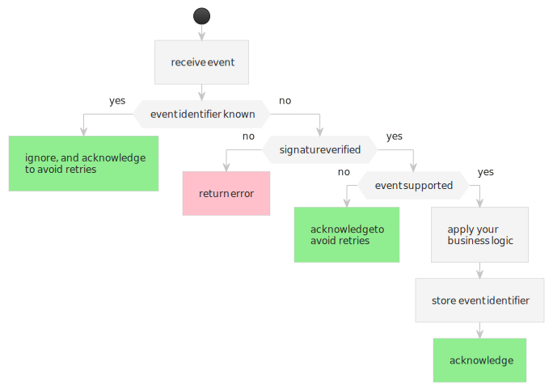

# Overview




Rabo Smart Pay offers multiple events, managed trough your webhook subscriptions.

:::danger always verify the signature

Before processing events, your server __[must always verify the signature](./verifying-signatures.md)__ on the event!

:::

The easiest way to process events is to use the [Rabo Smart Pay SDK](#):

```java
SmartPay smartPay = new SmartPay(REFRESH_TOKEN);

private String webhook(Request request, Response response) {
  try {
    var event = smartPay.processWebhook<Event.OrderStatusFinalizedV1>(request);

    // If we dont know the event, we should ignore it, and acknowledge the delivery
    if (event == null) {
      response.status(200);
      return "ack";
    }

    applyBusinessLogic(event);  // this is where you apply your business logic

  } catch (SmartPayException e) {
    response.status(500);
    return e.getMessage();
  }
  
  response.status(200);
  return "ack";
}
```

When Rabo Smart Pay delivers events to your server, it always includes a `x-smartpay-event-type` HTTP header. Your
server must use this event type to determine if it should process the event contained in the request body.

In case your server doesn't know what to do with the event, your server should just acknowledge the event to Rabo Smart
Pay as to avoid getting the delivery [retried](./retrying-failed-deliveries.md). You should investigate why this event
was delivered to you by checking your [webhook subscriptions](../managing-subscriptions.md).
