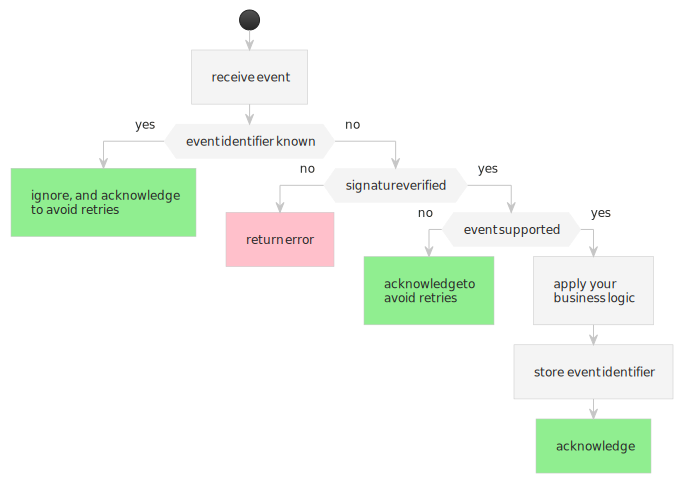

# Processing events



The easiest way to process events is by using the [Rabo Smart Pay SDK](#):

```java
SmartPay smartPay = new SmartPay(REFRESH_TOKEN);

private String webhook(Request request, Response response) {
  try {
    var event = smartPay.processWebhook<Event.OrderStatusFinalizedV1>(request);

    // If we dont know the event, we should ignore it, and acknowledge the delivery
    if (event == null) {
      response.status(200);
      return "ack";
    }

    applyBusinessLogic(event);  // this is where you apply your business logic

  } catch (SmartPayException e) {
    response.status(500);
    return e.getMessage();
  }
  
  response.status(200);
  return "ack";
}
```

:::info
In case your server doesn't know what to do with the event, your server should just acknowledge the event to Rabo Smart
Pay as to avoid getting the delivery [retried](./retrying-failed-deliveries.md).

You should investigate why this event was delivered to you by checking your
[webhook subscriptions](../managing-subscriptions.md).
:::

:::danger always verify the signature

If you are not using the SDK, your server __[must verify the signature manually](./verifying-signatures.md)__!

:::