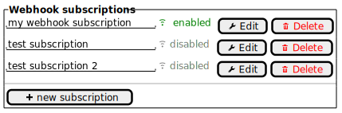

import Tabs from '@theme/Tabs';
import TabItem from '@theme/TabItem';

# Managing webhook subscriptions

Rabo Smart Pay delivers events to your server using one or more webhook subscriptions, a subscription consist of:
1. A destination in the form of an HTTP endpoints controlled by the you.
2. A set of [event types](./accepting-events/types-of-events.md) that will be delivered to the destination.
3. Optionally a textual description of the webhook.

Webhook subscriptions are managed through the dashboard, or using the
[Webhook Subscriptions Management API](/oas/webhook-subscriptions-management-api).

The default maximum number of total webhook subscriptions is 32.

## Basic Usage
#### Listing all subscriptions
<Tabs groupId="languague">
    <TabItem value="dashboard" label="Dashboard">



    </TabItem>
    <TabItem value="java" label="Java">
```java
SmartPay smartPay = new SmartPay(REFRESH_TOKEN);
List<WebhookSubscription> subscriptions = smartPay.webhookSubscriptions.list();
```
    </TabItem>
</Tabs>

#### Create a new subscription
<Tabs groupId="languague">
    <TabItem value="dashboard" label="Dashboard">


Starting at the webhook subscriptions overview:
1. Click `New subscription`
2. Fill in the relevant details.
3. Click `Create`

</TabItem>
    <TabItem value="java" label="Java">
```java
SmartPay smartPay = new SmartPay(REFRESH_TOKEN);
smartPay.webhookSubscriptions.create(
    WebhookSubscription.builder()
        .description("My Subscription")
        .url(new URI("https://www.example.com/callback"))
        .event(Event.OrderStatusFinalizedV1)
        .build()
);
```
    </TabItem>
</Tabs>

#### Disable a subscription
<Tabs groupId="languague">
    <TabItem value="dashboard" label="Dashboard">


Starting at the webhook subscriptions overview:
1. Find the subscription to disable.
2. Click `Edit`.
3. In the status dropdown, select `disabled`.
4. Click `Update`.

</TabItem>
    <TabItem value="java" label="Java">
```java
SmartPay smartPay = new SmartPay(REFRESH_TOKEN);
smartPay.webhookSubscriptions.disable("wsb_akn89a3no4n2rcas4jssa");
```
    </TabItem>
</Tabs>

:::info Outstanding deliveries on changes

Whenever you disable, or delete a webhook subscription that still has outstanding deliveries, Rabo Smart Pay will still
attempt to deliver those events. Keep this in mind when disabling a webhook subscription; the destination might still
receive events afterwards.

If you change the destination of a webhook subscription, any outstanding deliveries will be sent to the new destination.

:::