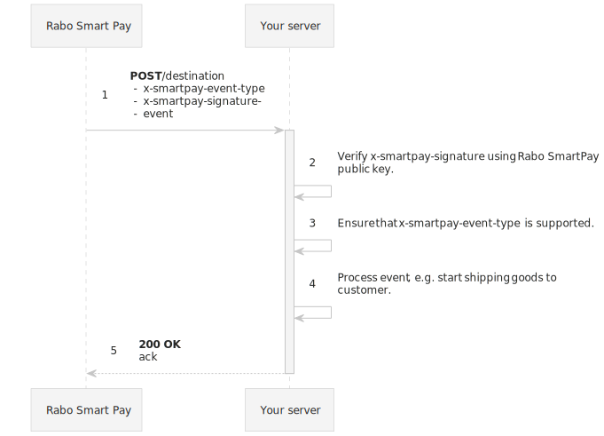

# Webhook lifecycle

Whenever an event occurs that you are subscribed to, Rabo Smart Pay will deliver that event to your server.

Your server then must:
1. [Accept the event](./implementation-guide.md).
2. [Verify the event's signature](./accepting-events/verifying-signatures.md).
3. [Process the event](./accepting-events/processing-events.md).
4. And finally [Acknowledge the event](./accepting-events/acknowledging-events.md).

:::note Use the SDK

You should use the [Rabo Smart Pay SDK](#) when integrating webhooks into your platform.

The SDK will take care of most stuff regarding webhooks, you will just need to bring your business logic.

:::
